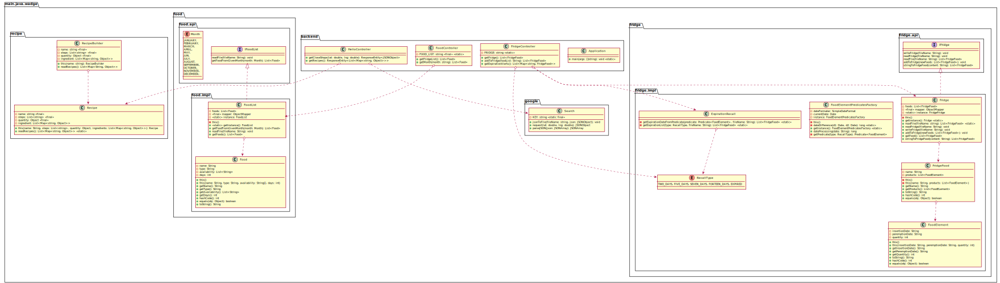
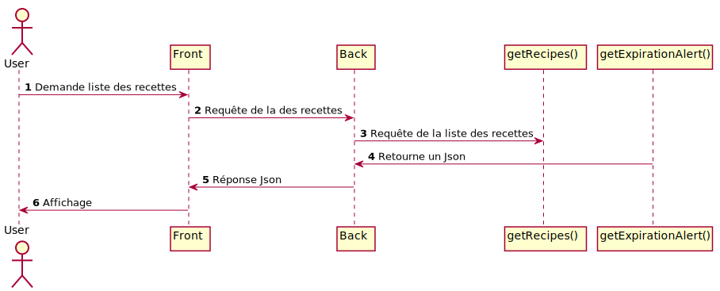

= Wadge-BackEnd
Doc Writer <project.wadge@gmail.com>

Beaucoup de personnes ne portent pas une grande attention à ce qu’elles achètent et se retrouvent avec des aliments périmés. Elles doivent donc les jeter. Certaines mangent systématiquement la même chose et seraient ravies de découvrir de nouvelles recettes.
D’autant plus s’ils ont déjà tous les aliments nécessaires chez eux. D’autres encore souhaitent consommer les aliments de saison pour ne pas faire importer de produits.

Nous avons créer une application pour gérer divers aspect de l’univers culinaire. Le gachis alimentaire est adressé au travers d’un suivi des dates de péremption des produits que l’on possède chez soi. Les nombreuses importations de produits sont limitées par la mise en évidence des fruits et légumes de saison directement dans des recettes associées.

Wadge est une application composée en deux parties. La première, 
link:https://github.com/RomainVacheret/Wadge-BackEnd[Wadge-BackEnd] correspond au code métier Java qui a pour but de gérer toutes requêtes ( création du frigo, modifier le frigo, lire et afficher les aliments ). Tandis que 
link:https://github.com/RomainVacheret/Wadge-FrontEnd[Wadge-FrontEnd] à pour objectif de simplifier l'interaction entre le BackEnd et l'utilisateur.

NavBar plus simple. 

== Routes
[cols="h,5a"]
|===
| URL
| /food_list
| Method
| GET
| Response Body
| [...
    {
        "nom": "mandarine",
        "type": "fruit",
        "consommation": ["janvier", "fevrier", "octobre", "novembre", "decembre"]
    }...
]
|===

[cols="h,5a"]
|===
| URL
| /map/{lat}/{lng}
| Method
| GET
| Response Body
|{"candidates":[{"formatted_address":"58 Rue du Général de Gaulle, 95880 Enghien-les-Bains, France","opening_hours":{"open_now":true},"location":{"lng":2.3052543,"lat":48.9695271}}]}
|===

[cols="h,5a"]
|===
| URL
| /filter/{month}
| Method
| GET
| Response Body
| [
    {
        "type": "legume",
        "nom": "ail"
    }...
]
|===

[cols="h,5a"]
|===
| URL
| /alerts
| Method
| GET
| Response Body
| 
    {
        "TWO_DAYS":[
            {"dateAjout":"01/11/2020","quantite":"24","nom":"poire"},{"dateAjout":"10/10/2020","quantite":"2","nom":"poireau"}
        ], 
        "FIVE_DAYS":[], 
        "EXPIRED":[
            {"dateAjout":"10/10/2020","quatite":"2","nom":"poire"},{"dateAjout":"01/11/2020","quantite":"12","nom":"poireau"}
        ], ...
    }
|===

[cols="h,5a"]
|===
| URL
| /alert/{type}
| Method
| GET
| Response Body
| 
    [
        {"dateAjout":"01/11/2020","quantite":"24","nom":"poire"},{"dateAjout":"10/10/2020","quantite":"2","nom":"poireau"},
        ...
    ]
|===

== Diagramme de classe

Notre code est ordonné autour de cinq packages : "backend", "food", "fridge", "google", "recipe". Ils sont s'occupent respectivement des controlleurs de l'API, des aliments, du frigo, de l'utilisation de l'API Google et des recettes.
Plus précisément, le package "food" est un intermédaire entre les aliments stockés et le reste de l'application. Le package "fridge" se concentre sur les requêtes autour du frigo. Par exemple l'affichage ou le remplissage de celui-ci. L'API Google est utlisé pour informé l'utilisateur des magasins à sa disposition dans ses environs. Enfin, le package "recipe" est une première approche de la gestion de recettes proposées à l'utilisateur.
Chacun de ces quatre dernier packages ont un controlleur servant d'intermédaire pour l'API.

== Différents diagrammes de séquences (système)
=== Carte
image::./diagram/out/SequenceDiagramMap.svg[]
=== Liste des aliments en fonction d'un mois donné
image::./diagram/out/monthFilterSystem.svg[]
=== Liste des aliments à manger aux différents dates
image::./diagram/out/getFridgeSystem.svg[]
=== Liste des recettes

=== Ajout d'aliments au frigo
image::./diagram/out/addToFridgeSystem.svg[]

== Différents diagrammes de séquences (classiques)
=== Carte
image::./diagram/out/SequenceDiagramMap.svg[]
=== Liste des aliments en fonction d'un mois donné
image::./diagram/out/monthFilter.svg[]
=== Liste des aliments à manger aux différents dates
image::./diagram/out/getFridge.svg[]
=== Liste des recettes

=== Ajout d'aliments au frigo
image::./diagram/out/addToFridge.svg[]