= Wadge-BackEnd
Doc Writer <project.wadge@gmail.com>

Beaucoup de personnes ne portent pas une grande attention à ce qu’elles achètent et se retrouvent avec des aliments périmés. Elles doivent donc les jeter. Certaines mangent systématiquement la même chose et seraient ravies de découvrir de nouvelles recettes.
D’autant plus s’ils ont déjà tous les aliments nécessaires chez eux. D’autres encore souhaitent consommer les aliments de saison pour ne pas faire importer de produits.

Nous avons créer une application pour gérer divers aspect de l’univers culinaire. Le gachis alimentaire est adressé au travers d’un suivi des dates de péremption des produits que l’on possède chez soi. Les nombreuses importations de produits sont limitées par la mise en évidence des fruits et légumes de saison directement dans des recettes associées.

Wadge est une application composée en deux parties. La première, 
link:https://github.com/RomainVacheret/Wadge-BackEnd[Wadge-BackEnd] correspond au code métier Java qui a pour but de gérer toutes requêtes ( création du frigo, modifier le frigo, lire et afficher les aliments ). Tandis que 
link:https://github.com/RomainVacheret/Wadge-FrontEnd[Wadge-FrontEnd] à pour objectif de simplifier l'interaction entre le BackEnd et l'utilisateur.

== Les Personas
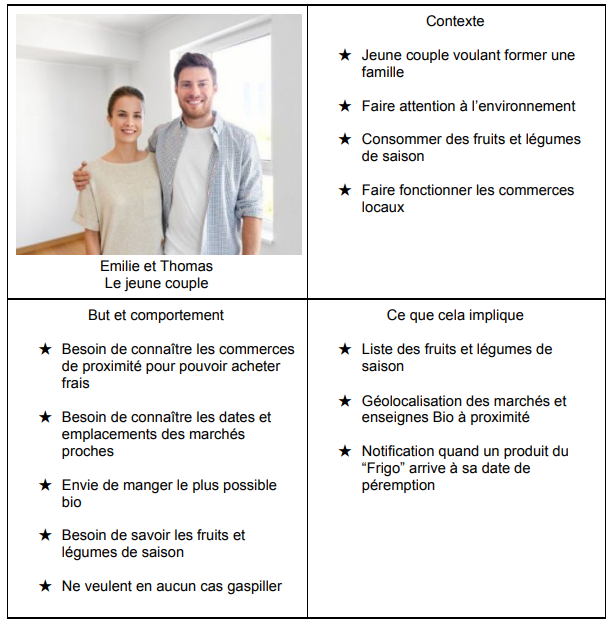
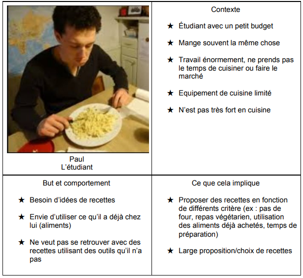
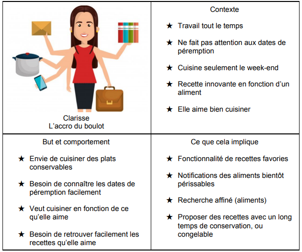
== Diagrammes de classe

Notre code est ordonné autour de 4 packages principaux : `api`, `dao`, `model` et `service`. 
Dans chacun des ces packages, nous retrouvons les catégoires `food`, `recipe`, `fridge` qui représentent respectivement les aliments de saison, des recettes, et un frigo.

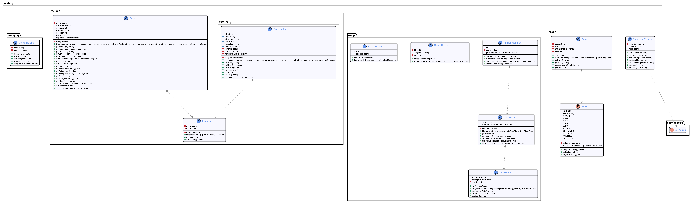
Le package `model` gère la structure des éléments d'un point de vu métier.

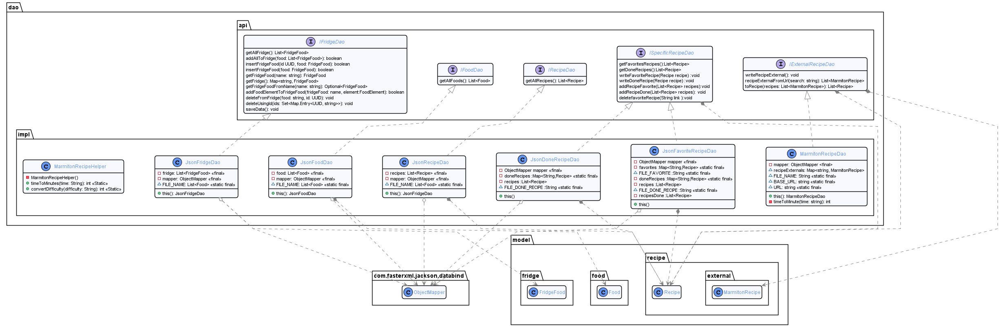
Le package `dao` se concentre sur l'accès des données.

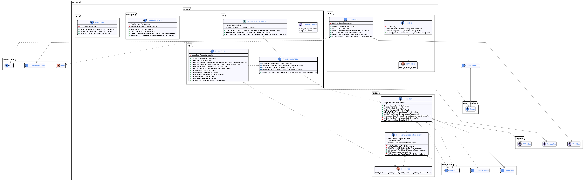
Le package `service` s'occupe de la manipulation des données récupérées depuis les DAO.

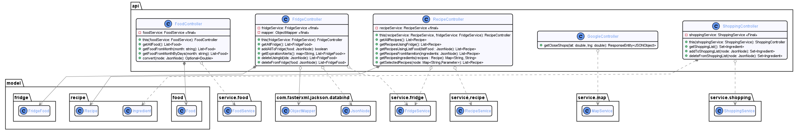
Enfin, le package `api` est l'intermédiaire entre le code métier et l'utilisateur.

== Différents diagrammes de séquences (système)
=== Liste des aliments en fonction d'un mois donné
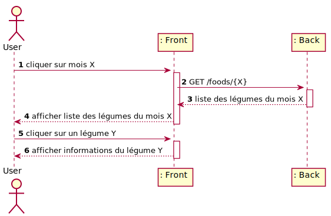
=== Liste des aliments à manger aux différents dates
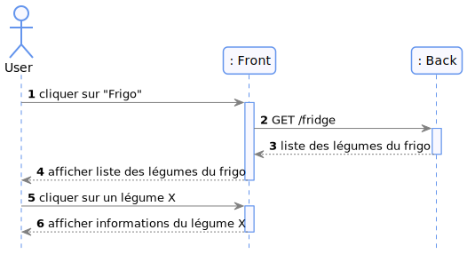
=== Liste des recettes
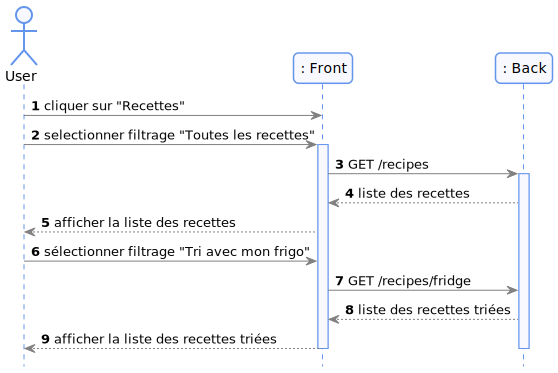
=== Ajout d'aliments au frigo
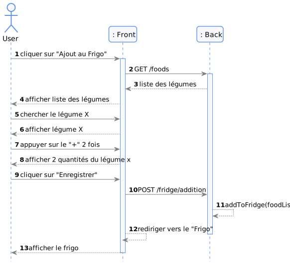
=== Suppression d'aliments du frigo
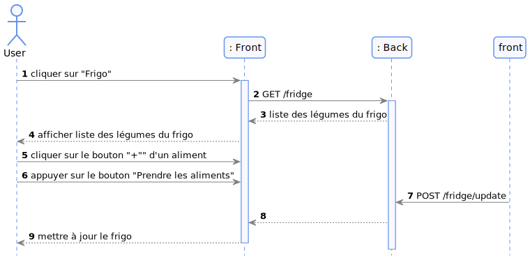
=== Suppression des aliments périmés ou de l'intégralité du frigo
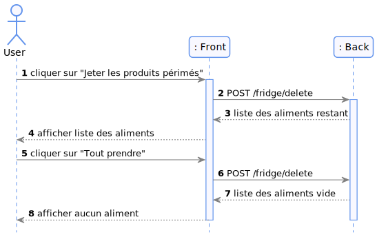
=== Conversion d'un poids en unité
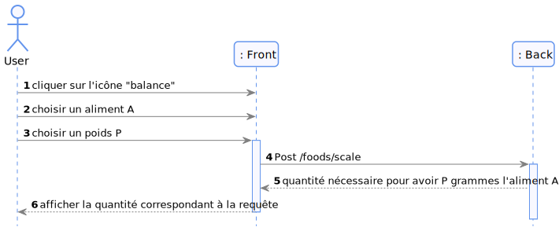
=== Conversion d'une unité en poids
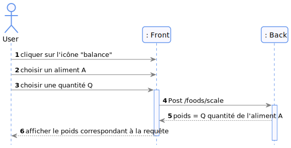
=== Ajout d'une recette au favories
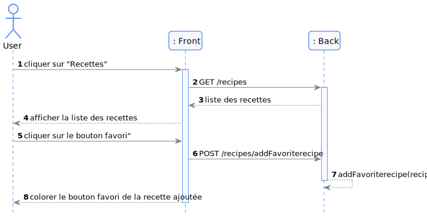
=== liste des recettes favorites
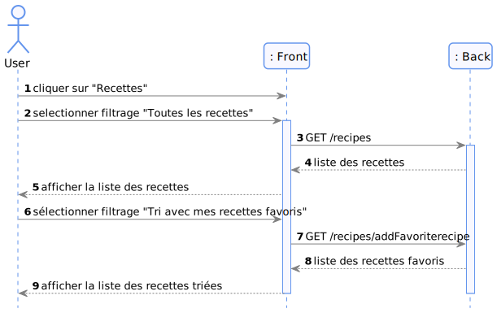
=== Suppression d'une recette favorite
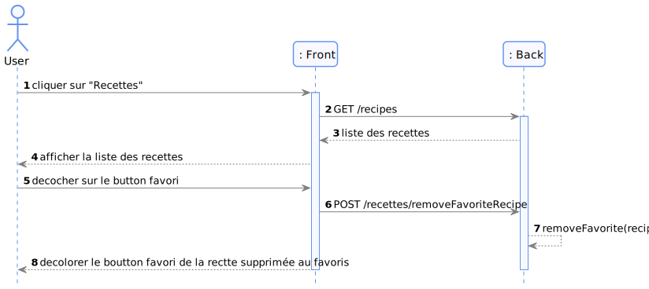
=== Ajout d'une recette réalisée
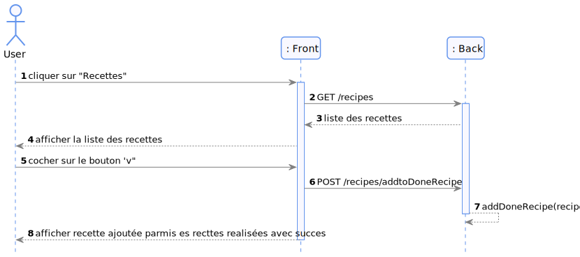
=== liste des recettes réalisées
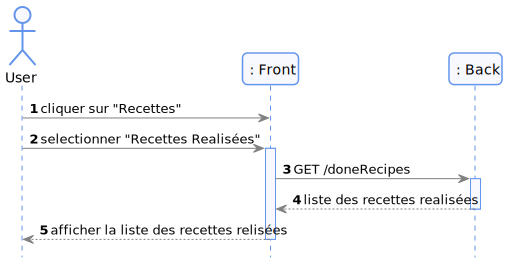

== Différents diagrammes de séquences (internes)

=== Liste des aliments en fonction d'un mois donné
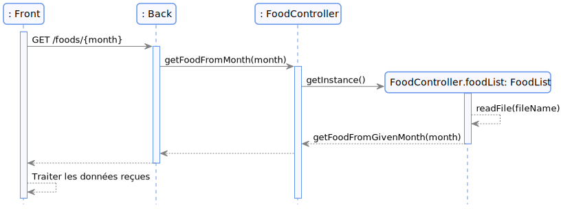
=== Liste des aliments en fonction d'un mois donné trié en fonction des péremptions
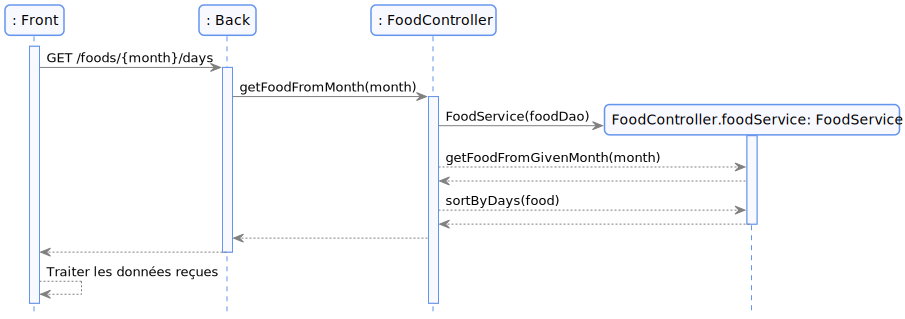
=== Liste des aliments à manger aux différents dates
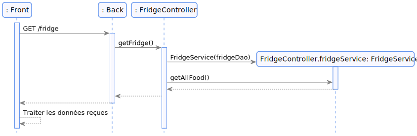
=== Liste des recettes

=== Liste des recettes trié en fonction du contenu du frigo
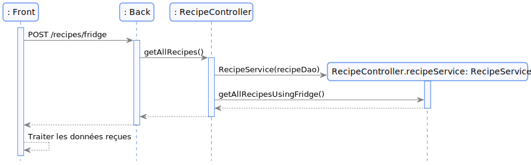
=== Liste des recettes filtrées en fonction d'une liste d'aliments
image::./diagram/out/recipesFilterByList.svg[]
=== Liste des recettes récupérées depuis Marmiton
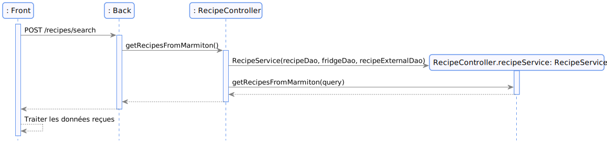
=== Ajout d'aliments au frigo
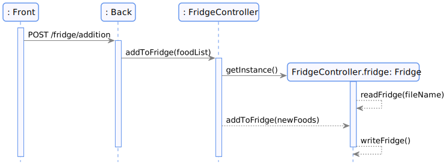
=== Suppression d'aliemnt du frigo
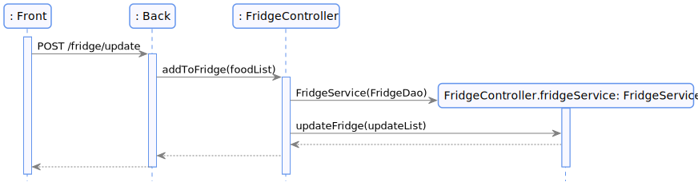
=== Ajout d'une recette au favories
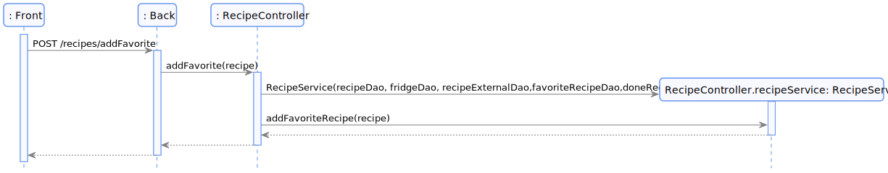
=== liste des recettes favorites
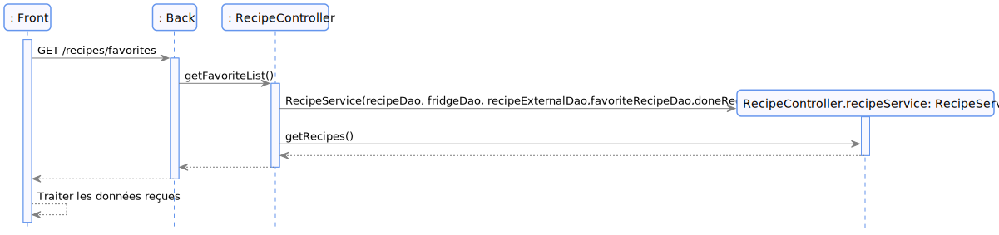
=== Suppression d'une recette favorite
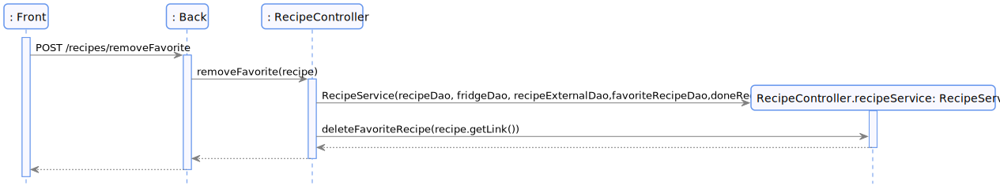
=== Ajout d'une recette realisee
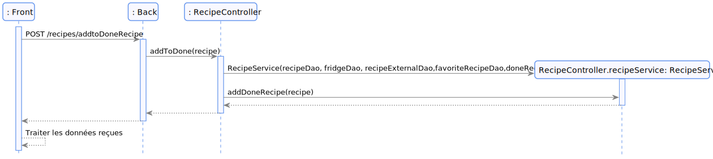
=== liste des recettes réalisées
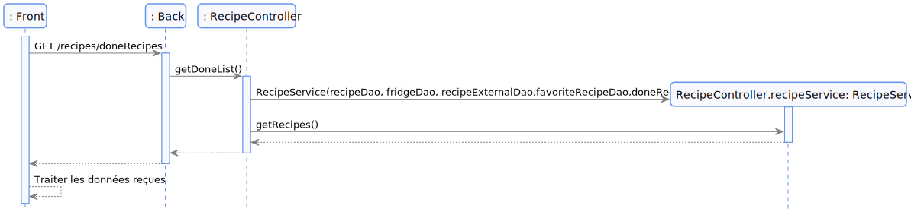
=== Suppression d'aliment du frigo

=== Ajout d'une balance de conversion
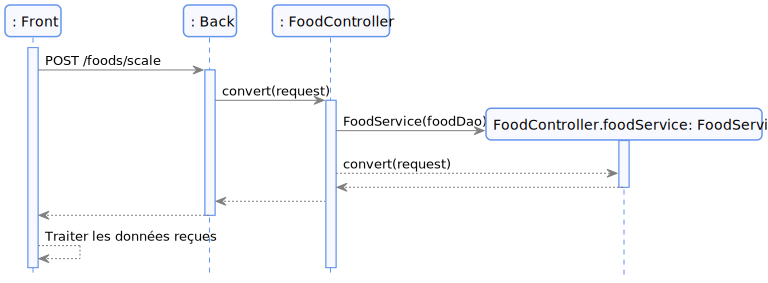

