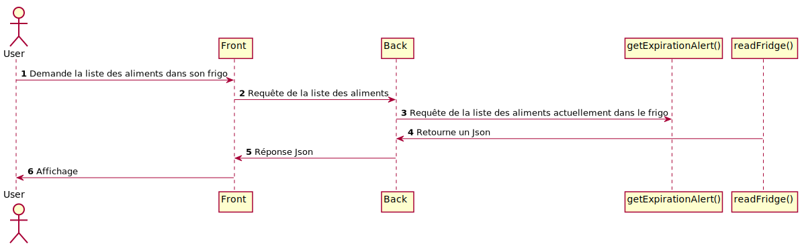
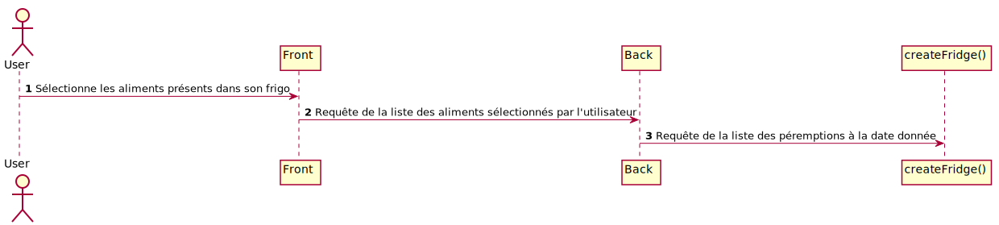

= Wadge-BackEnd
Doc Writer <project.wadge@gmail.com>

== Routes
[cols="h,5a"]
|===
| URL
| /food_list
| Method
| GET
| Response Body
| [...
    {
        "nom": "mandarine",
        "type": "fruit",
        "consommation": ["janvier", "fevrier", "octobre", "novembre", "decembre"]
    }...
]
|===

[cols="h,5a"]
|===
| URL
| /map/{lat}/{lng}
| Method
| GET
| Response Body
|{"candidates":[{"formatted_address":"58 Rue du Général de Gaulle, 95880 Enghien-les-Bains, France","opening_hours":{"open_now":true},"location":{"lng":2.3052543,"lat":48.9695271}}]}
|===

[cols="h,5a"]
|===
| URL
| /filter/{month}
| Method
| GET
| Response Body
| [
    {
        "type": "legume",
        "nom": "ail"
    }...
]
|===

[cols="h,5a"]
|===
| URL
| /alerts
| Method
| GET
| Response Body
| 
    {
        "TWO_DAYS":[
            {"dateAjout":"01/11/2020","quantite":"24","nom":"poire"},{"dateAjout":"10/10/2020","quantite":"2","nom":"poireau"}
        ], 
        "FIVE_DAYS":[], 
        "EXPIRED":[
            {"dateAjout":"10/10/2020","quatite":"2","nom":"poire"},{"dateAjout":"01/11/2020","quantite":"12","nom":"poireau"}
        ], ...
    }
|===

[cols="h,5a"]
|===
| URL
| /alert/{type}
| Method
| GET
| Response Body
| 
    [
        {"dateAjout":"01/11/2020","quantite":"24","nom":"poire"},{"dateAjout":"10/10/2020","quantite":"2","nom":"poireau"},
        ...
    ]
|===

== Diagramme de classe
image::./diagram/out/Wadge-BackEnd.svg[]
== Différents diagrammes de séquences
=== Carte
image::./diagram/out/SequenceDiagramMap.svg[]
=== Liste des aliments en fonction d'un mois donné
image::./diagram/out/SequenceDiagramFilter.svg[]
=== Liste des aliments avec leur mois de consommation
image::./diagram/out/SequenceDiagramFoodList.svg[]
=== Liste des aliments à manger avant une certaine date
image::./diagram/out/SequenceDiagramAlert.svg[]
=== Liste des aliments à manger aux différents dates
image::./diagram/out/SequenceDiagramAlerts.svg[]
=== Liste des recettes
image::./diagram/out/SequenceDiagramRecipes.svg[]
=== Liste des aliments présents dans le frigo

=== Ajout d'aliments au frigo
