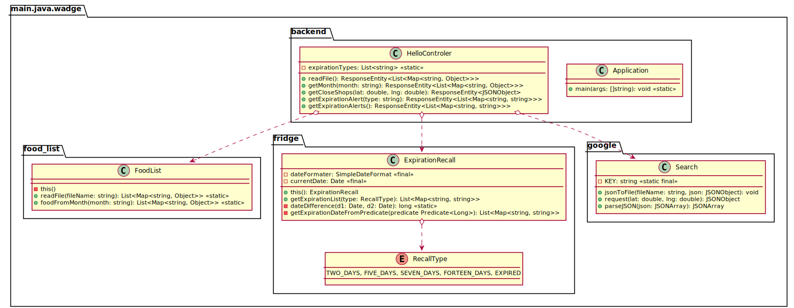
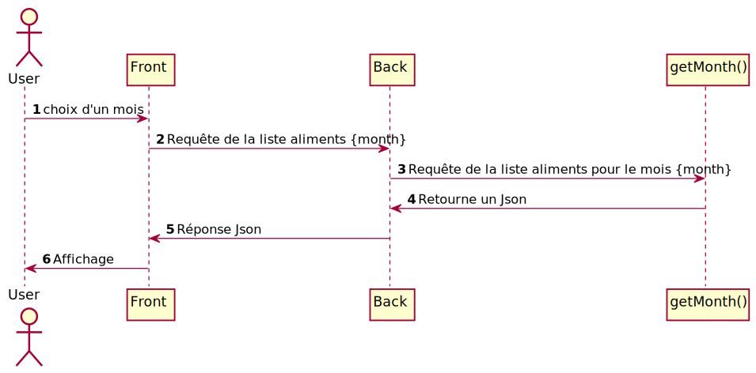
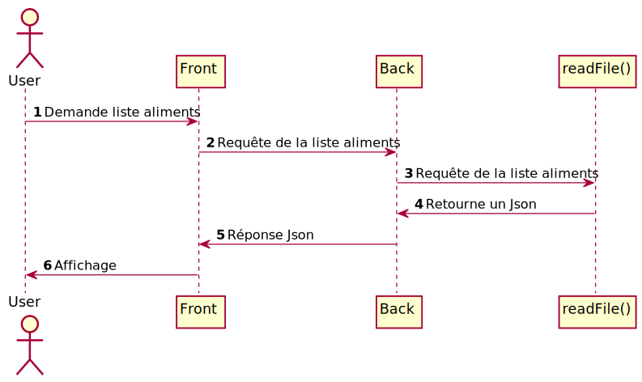
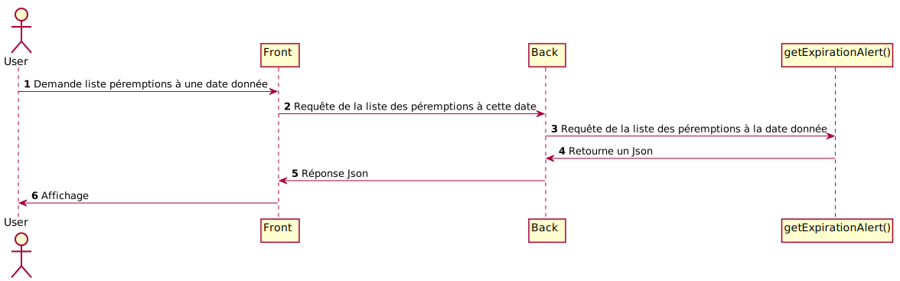
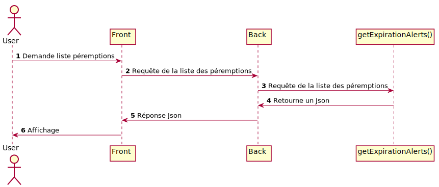

= Wadge-BackEnd
Doc Writer <project.wadge@gmail.com>

== Routes
[cols="h,5a"]
|===
| URL
| /food_list
| Method
| GET
| Response Body
| [...
    {
        "nom": "mandarine",
        "type": "fruit",
        "consommation": ["janvier", "fevrier", "octobre", "novembre", "decembre"]
    }...
]
|===

[cols="h,5a"]
|===
| URL
| /map/{lat}/{lng}
| Method
| GET
| Response Body
|{"candidates":[{"formatted_address":"58 Rue du Général de Gaulle, 95880 Enghien-les-Bains, France","opening_hours":{"open_now":true},"location":{"lng":2.3052543,"lat":48.9695271}}]}
|===

[cols="h,5a"]
|===
| URL
| /filter/{month}
| Method
| GET
| Response Body
| [
    {
        "type": "legume",
        "nom": "ail"
    }...
]
|===

== Différents diagrammes de séquences
=== Carte
image::./diagram/out/SequenceDiagramMap.svg[]
=== Liste des aliments en fonction d'un mois donné

=== Liste des aliments avec leur mois de consommation

=== Liste des aliments à manger avant une certaine date

=== Liste des aliments à manger aux différents dates
