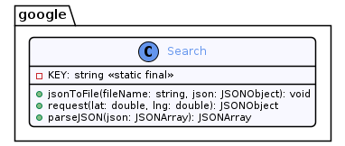
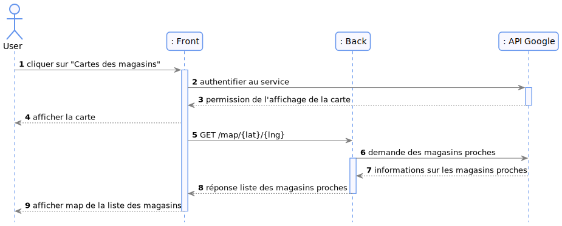
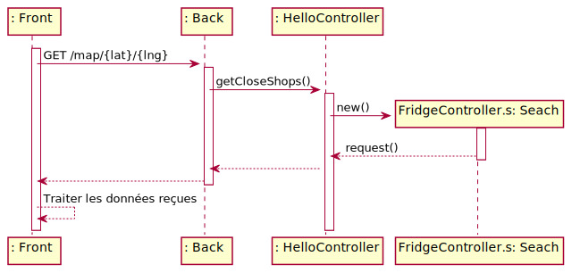

= Wadge-BackEnd
Doc Writer <project.wadge@gmail.com>

Beaucoup de personnes ne portent pas une grande attention à ce qu’elles achètent et se retrouvent avec des aliments périmés. Elles doivent donc les jeter. Certaines mangent systématiquement la même chose et seraient ravies de découvrir de nouvelles recettes.
D’autant plus s’ils ont déjà tous les aliments nécessaires chez eux. D’autres encore souhaitent consommer les aliments de saison pour ne pas faire importer de produits.

Nous avons créer une application pour gérer divers aspect de l’univers culinaire. Le gachis alimentaire est adressé au travers d’un suivi des dates de péremption des produits que l’on possède chez soi. Les nombreuses importations de produits sont limitées par la mise en évidence des fruits et légumes de saison directement dans des recettes associées.

Wadge est une application composée en deux parties. La première, 
link:https://github.com/RomainVacheret/Wadge-BackEnd[Wadge-BackEnd] correspond au code métier Java qui a pour but de gérer toutes requêtes ( création du frigo, modifier le frigo, lire et afficher les aliments ). Tandis que 
link:https://github.com/RomainVacheret/Wadge-FrontEnd[Wadge-FrontEnd] à pour objectif de simplifier l'interaction entre le BackEnd et l'utilisateur.

== Les Personas
image::./img/personas/persona-couple.png[]
image::./img/personas/persona-student.png[]
image::./img/personas/persona-worker.png[]
== Diagrammes de classe

Notre code est ordonné autour de 4 packages principaux : `api`, `dao`, `model` et `service`. 
Dans chacun des ces packages, nous retrouvons les catégoires `food`, `recipe`, `fridge` qui représentent respectivement les aliments de saison, des recettes, et un frigo.

image::./diagram/out/model.png[]
Le package `model` gère la structure des éléments d'un point de vu métier.

image::./diagram/out/dao.png[]
Le package `dao` se concentre sur l'accès des données.

image::./diagram/out/service.png[]
Le package `service` s'occupe de la manipulation des données récupérées depuis les DAO.

image::./diagram/out/api.png[]
Enfin, le package `api` est l'intermédiaire entre le code métier et l'utilisateur.

Nous avons également un autre packages `google` qui gère l'api google.

Le package `google` utilise API Google pour informé l'utilisateur des magasins à sa disposition dans ses environs.

== Différents diagrammes de séquences (système)
=== Carte

=== Liste des aliments en fonction d'un mois donné
image::./diagram/out/monthFilterSystem.svg[]
=== Liste des aliments à manger aux différents dates
image::./diagram/out/getFridgeSystem.svg[]
=== Liste des recettes
image::./diagram/out/recipesSystem.svg[]
=== Ajout d'aliments au frigo
image::./diagram/out/addToFridgeSystem.svg[]

== Différents diagrammes de séquences (internes)
=== Carte

=== Liste des aliments en fonction d'un mois donné
image::./diagram/out/monthFilter.svg[]
=== Liste des aliments à manger aux différents dates
image::./diagram/out/getFridge.svg[]
=== Liste des recettes
image::./diagram/out/recipes.svg[] 
=== Ajout d'aliments au frigo
image::./diagram/out/addToFridge.svg[]

== Annexes

=== Routes
[cols="h,5a"]
|===
| URL
| /foods
| Method
| GET
| Response Body
| [...
    {
        "nom": "mandarine",
        "type": "fruit",
        "consommation": ["janvier", "fevrier", "octobre", "novembre", "decembre"]
    }...
]
|===

[cols="h,5a"]
|===
| URL
| /map/{lat}/{lng}
| Method
| GET
| Response Body
|{"candidates":[{"formatted_address":"58 Rue du Général de Gaulle, 95880 Enghien-les-Bains, France","opening_hours":{"open_now":true},"location":{"lng":2.3052543,"lat":48.9695271}}]}
|===

[cols="h,5a"]
|===
| URL
| /foods/{month}
| Method
| GET
| Response Body
| [
    {
        "name":"ananas",
        "type":"fruit",
        "availability":
        [
            "janvier",
            "fevrier",
            "mars",
            "avril",
            "octobre",
            "novembre",
            "decembre"
        ],
        "days":5
    },
    {
        "name":"avocat",
        "type":"fruit",
        "availability":
        [
            "janvier",
            "fevrier",
            "mars",
            "avril",
            "octobre",
            "novembre",
            "decembre"
        ],
        "days":3
    }...
]
|===

[cols="h,5a"]
|===
| URL
| /alerts
| Method
| GET
| Response Body
| 
    {
        "TWO_DAYS":[
            {"dateAjout":"01/11/2020","quantite":"24","nom":"poire"},{"dateAjout":"10/10/2020","quantite":"2","nom":"poireau"}
        ], 
        "FIVE_DAYS":[], 
        "EXPIRED":[
            {"dateAjout":"10/10/2020","quatite":"2","nom":"poire"},{"dateAjout":"01/11/2020","quantite":"12","nom":"poireau"}
        ], ...
    }
|===

[cols="h,5a"]
|===
| URL
| /alert/{type}
| Method
| GET
| Response Body
| 
    [
        {"dateAjout":"01/11/2020","quantite":"24","nom":"poire"},{"dateAjout":"10/10/2020","quantite":"2","nom":"poireau"},
        ...
    ]
|===

[cols="h,5a"]
|===
| URL
| /fridge
| Method
| GET
| Response Body
| 
    [
        {"name":"banane","products":[{"insertionDate":"17/11/2020","peremptionDate":"01/12/2020","quantity":2}
        ...
    ]
|===

[cols="h,5a"]
|===
| URL
| /fridge/addition
| Method
| POST
| Response Body
| 
    []
|===

[cols="h,5a"]
|===
| URL
| /recipes
| Method
| GET
| Response Body
| 
    [
        {"personnes":3,"ingredients":[{"nom":"carotte","quantite":2},{"nom":"butternut","quantite":0.5},{"nom":"pomme de terre","quantite":1},{"nom":"oignon","quantite":1},{"nom":"celeri","quantite":0.75},{"nom":"navet","quantite":1},{"nom":"persil","quantite":-1},{"nom":"bouillon cube","quantite":-1},{"nom":"cumin","quantite":-1}],"difficulte":1,"nom":"Soupe d'automne à la courge de butternut","etapes":["Faire revenir ensemble dans une cocotte, avec une cuillère d'huile d'olive, l'oignon, le céleri et le navet émincés.","Faire revenir ensemble dans une poèle haute, carottes, courge et pomme de terre, épluchées et coupées en petites cubes. Dès que c'est grillé, verser ces légumes dans la cocotte.","Verser 1.25 litre d'eau froide.","Ajouter le bouillon cube et une petite cuillerée de cumin.","Dès le bouillonnement de l'eau, baisser le feu et laisser cuire 20, 25 min.","En cours de cuisson, ajouter une poignée de persil frisé émincé.","En fin de cuisson, mixer le tout et vérifier l'assaisonnement."
        }...
    ]
        
|===